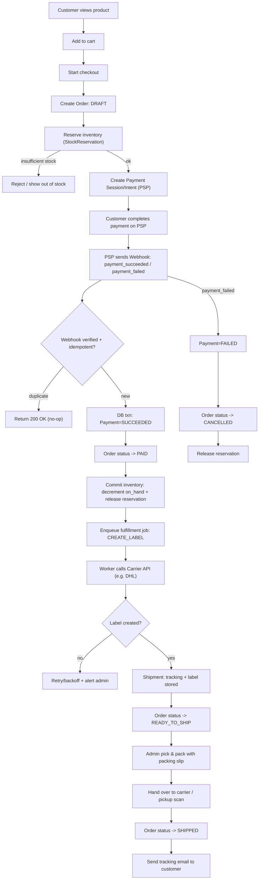

Repo to the FastAPI of the OpenTaberna Project. See [Wiki](https://wiki.opentaberna.de) for more information.

# Coding Guidlines

**Tooling**
- Python 3.14
- uv package manager 0.4.0
- Docker
- Ruff 0.14.5

# Dev Setup

For code development use `uv` package manager. After installation go into the root directory of this repository and run:

```bash
uv sync
```

To start the API locally:
```bash
source .venv/bin/activate
python3 src/app/main.py
```

To test the Setup:

Take a look at the `docker-compose.dev.yml` file. It provides a dev docker setup for local development. Run:

```bash
docker compose up -f docker-compose.dev.yml -d
```

# Pipelines

This FastAPI can be build and tested via GitHub workflows. There are two available workflows:
1. test.yml -> to test the API
2. test-build-deploy.yml -> runs pytest for minor checks and builds the docker image.

## test.yml

This Pipeline is can be triggered either by merging a PR into main or run it manually in the Repository Action section.

The workflow tests for:
1. System Integration
2. Pytest
3. Linter and Formatter
4. Trivy checks dependencys
5. Bandit to audit the code

All results are uploaded as Artifacts.

## test-build-deploy.yml

This workflow runs small pytests before it builds the docker image for the API. After a successful build the image gets pushed into the organizations docker registry. The last Job deploys the whole `docker-compose.yml` in the root directory to a Portainer instance.

The workflow can be triggerd by a tag on any commit:

```bash
git tag vX.X.X && git push origin vX.X.X
```

> [!CAUTION]
> The workflow only tells if a deployment started on portainer. It can not detect if the API container or any other container fails on start as long as the container gets marked as "running".

---

## Shipping flow



### Phase 0 — Foundations (do this first)

1. Core domain + DB schema
- Product/SKU, Inventory, Order, OrderItem, Customer, Address

2. Order state machine
- DRAFT → PENDING_PAYMENT → PAID → READY_TO_SHIP → SHIPPED
- PENDING_PAYMENT → CANCELLED (timeout / failed)

3. Idempotency & constraints
- Unique constraints for “one shipment label per order”
- Event inbox table (dedupe webhook events)

### Phase 1 — Checkout (money + stock safety)

1. Cart + Checkout draft API
- Create draft order and line items with price snapshots

2. Inventory reservations
- Reserve on checkout start; expiry + cleanup job

3. Payment provider integration (PSP)
- Create payment session/intent; store provider reference

4. Webhook endpoint (authoritative payment confirmation)
- Signature verification
- Idempotent processing
- Transactional transition to PAID + commit inventory

### Phase 2 — Admin fulfillment without carrier integration (ship manually first)

1. Admin order list + detail
- Filter by status: PAID / READY_TO_SHIP / SHIPPED

2. Pick/pack documents
- Packing slip + pick list (PDF optional, HTML fine initially)

3. Manual shipment marking
- Admin enters tracking number manually
- Customer notification email

(At this point you have a working webshop that can get paid, manage stock correctly, and ship manually.)

### Phase 3 — Automation: DHL label generation

1. Background job system
- Worker + queue; retry/backoff; dead-letter + alerts

2. Carrier abstraction layer
- CarrierAdapter.create_label(order) interface

3. DHL adapter
- Create label, store PDF/ZPL, tracking number

4. Admin label printing + shipment workflow
- “Create label” / “Recreate label” rules
- Print label + packing slip from admin

### Phase 4 — Operational hardening (what makes it production-grade)

1. Outbox pattern for reliable job enqueueing

2. Observability
- Structured logs, correlation IDs, metrics

3. Fraud/edge-case handling
- Payment reversals/refunds → inventory & order adjustments

4. Returns + refunds (basic RMA)

5. Partial fulfillment / split shipments (optional, later)

### Practical MVP scope (fastest path that still won’t bite you)

- Webhook-driven payment confirmation
- Reservation-based inventory
- Admin pick/pack + manual tracking
- Then add DHL labels