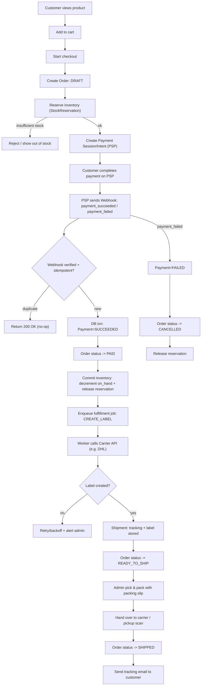

# Roadmap — OpenTaberna API

Implementierungsplan für den vollständigen Kunden-Kaufprozess:  
**Kunde betritt den Shop → sieht ein Item → klickt → kauft.**

Basis: `crud-item-store` (Items) ist fertig. Alle anderen Services werden hier geplant.

---

## Shipping Flow (Referenz)



---

## Alle Endpunkte

### Bereits vorhanden — `crud-item-store`

| Methode | Pfad | Was sie tut |
|---|---|---|
| `GET` | `/items` | Item-Liste mit Paginierung |
| `GET` | `/items/{sku}` | Ein Item per SKU |
| `GET` | `/items/{uuid}` | Ein Item per UUID |
| `POST` | `/items` | Item anlegen |
| `PATCH` | `/items/{uuid}` | Item aktualisieren |
| `DELETE` | `/items/{uuid}` | Item löschen |

---

### `customers` — Phase 0/1

| Methode | Pfad | Was sie tut |
|---|---|---|
| `GET` | `/customers/me` | Eigenes Kundenprofil abrufen (legt bei erstem Aufruf automatisch an) |
| `PATCH` | `/customers/me` | Eigenes Profil aktualisieren |
| `GET` | `/customers/me/addresses` | Alle Adressen des Kunden |
| `POST` | `/customers/me/addresses` | Neue Adresse anlegen |
| `PATCH` | `/customers/me/addresses/{id}` | Adresse aktualisieren |
| `DELETE` | `/customers/me/addresses/{id}` | Adresse löschen |

---

### `order-processing` — Phase 1

| Methode | Pfad | Was sie tut |
|---|---|---|
| `POST` | `/orders` | Draft-Order anlegen mit Line Items + Preissnapshot |
| `GET` | `/orders/{id}` | Order abrufen (nur eigene, Keycloak-gesichert) |
| `DELETE` | `/orders/{id}` | Draft-Order stornieren (nur DRAFT erlaubt) |
| `POST` | `/orders/{id}/checkout` | DRAFT → PENDING_PAYMENT: Inventar reservieren + PSP-Session erstellen, gibt PSP-Client-Secret zurück |
| `POST` | `/webhooks/stripe` | Stripe-Webhook: Signaturprüfung, Idempotenz, PAID oder CANCELLED je nach Event |

---

### `admin` — Phase 2

| Methode | Pfad | Was sie tut |
|---|---|---|
| `GET` | `/admin/orders` | Alle Orders, filterbar nach Status, paginiert |
| `GET` | `/admin/orders/{id}` | Order-Detail mit Items, Kunde, Adresse, Payment, Shipment |
| `PATCH` | `/admin/orders/{id}/status` | Manueller Status-Override mit Audit-Log |
| `GET` | `/admin/orders/{id}/packing-slip` | HTML-Packing-Slip (druckbar) für eine Order |
| `GET` | `/admin/orders/pick-list` | Aggregierte Pick-Liste über mehrere Orders (Batch-Picking) |
| `POST` | `/admin/orders/{id}/shipments` | Shipment anlegen mit manueller Tracking-Nummer → Order → READY_TO_SHIP |
| `POST` | `/admin/orders/{id}/ship` | Order → SHIPPED, löst Tracking-E-Mail aus |

---

### `fulfillment` — Phase 3

| Methode | Pfad | Was sie tut |
|---|---|---|
| `POST` | `/admin/orders/{id}/label` | DHL-Label-Job manuell anstoßen (oder bei Fehler neu triggern) |
| `GET` | `/admin/orders/{id}/label` | Label-PDF/ZPL herunterladen (Proxy aus Storage) |

---

### `returns` — Phase 4

| Methode | Pfad | Was sie tut |
|---|---|---|
| `POST` | `/orders/{id}/returns` | Kunde beantragt Rücksendung |
| `PATCH` | `/admin/returns/{id}` | Admin genehmigt/verarbeitet die Rücksendung |

---

### Infra / Health — Phase 4

| Methode | Pfad | Was sie tut |
|---|---|---|
| `GET` | `/health` | Liveness-Check (API läuft) |
| `GET` | `/health/ready` | Readiness-Check (DB + Redis erreichbar) |

---

## Implementierungsreihenfolge

### Phase 0 — Domain Models & DB Schema *(Blockiert alles andere)*

Kein Feature-Endpunkt ohne diese Grundlage. Beide können parallel arbeiten.

| Du | Kollege |
|---|---|
| **0.1** Customer + Address — Pydantic-Modelle, Alembic-Migration, Repository | **0.2** Inventory: `InventoryItem`, `StockReservation`, DB-Constraints (`on_hand >= reserved`), Repository |
| **0.5** Webhook Event Inbox — Modell + Migration (kurz, unabhängig) | *(parallel zu 0.2)* |
| → dann: **0.3** Order + OrderItem — abhängig von 0.1 + 0.2 | |
| **0.4** Payment-Modell + Migration | **0.6** Shipment-Modell + Migration |

**Fortschritt:** `[ ] 0.1` `[ ] 0.2` `[ ] 0.3` `[ ] 0.4` `[ ] 0.5` `[ ] 0.6`

---

### Phase 1 — Checkout & Payment (`services/order-processing/`)

| Du | Kollege |
|---|---|
| **1.1** `POST /orders` — Draft-Order + Business-Logik (Preissnapshot, Validierung, DRAFT-Status) | **1.4** PSP-Integration — `PaymentProviderAdapter` Interface + `StripeAdapter` (völlig unabhängig) |
| **1.2** Inventar-Funktionen — `reserve_inventory`, `release_reservation`, `commit_reservation`, `expire_reservations` | *(parallel zu 1.1)* |
| → dann: **1.3** `POST /orders/{id}/checkout` — braucht 1.1 + 1.2 + 1.4 | |
| → dann: **1.5** `POST /webhooks/stripe` — Signaturprüfung, Idempotenz, DB-Transaktion | |

> Nach Phase 1: funktionierender Webshop der Geld einnehmen und Stock sicher reservieren kann.

**Fortschritt:** `[ ] 1.1` `[ ] 1.2` `[ ] 1.3` `[ ] 1.4` `[ ] 1.5`

---

### Phase 2 — Admin-Fulfillment (`services/admin/`) *(kein Carrier nötig)*

| Du | Kollege |
|---|---|
| **2.1** `GET /admin/orders` + `GET /admin/orders/{id}` — Liste + Detail, paginiert, Status-Filter | **2.4** `send_tracking_email.py` + SMTP-Settings + HTML-E-Mail-Template |
| **2.2** `GET /admin/orders/{id}/packing-slip` + `pick-list` — HTML-Dokumente | *(parallel zu 2.1)* |
| → dann: **2.3** `POST /admin/orders/{id}/shipments` + `POST /admin/orders/{id}/ship` | |

> Nach Phase 2: **vollständiges lauffähiges MVP** — zahlender Kunde, korrekter Lagerbestand, manuell versendbar.

**Fortschritt:** `[ ] 2.1` `[ ] 2.2` `[ ] 2.3` `[ ] 2.4`

---

### Phase 3 — DHL-Label-Generierung (`services/fulfillment/`)

| Du | Kollege |
|---|---|
| **3.1** ARQ Job-System — Redis-Queue, `worker.py`, Retry/Backoff, Dead-Letter-Logging | **3.2** `CarrierAdapter` Interface + `ManualCarrierAdapter` (no-op, hält Interface konsistent) |
| **3.3** `DhlAdapter` — DHL Parcel DE REST API, Label PDF/ZPL, Storage (S3/MinIO) | **3.5** Outbox-Pattern — Outbox-Tabelle, Poller, zuverlässiges Job-Enqueuing in gleicher DB-Transaktion |
| **3.4** Admin-Label-Endpunkte `POST/GET /admin/orders/{id}/label` | |

**Fortschritt:** `[ ] 3.1` `[ ] 3.2` `[ ] 3.3` `[ ] 3.4` `[ ] 3.5`

---

### Phase 4 — Operational Hardening *(laufend parallel möglich)*

| Task | Was |
|---|---|
| **4.1** Observability | Correlation-ID-Middleware, strukturierte Logs mit `order_id`/`user_id`, `/health` + `/health/ready` |
| **4.2** Reservation-Expiry-Job | ARQ Scheduled Job — `expire_reservations()` alle N Minuten |
| **4.3** Payment Reversals | Stripe `charge.refunded` / `payment_intent.canceled` Webhooks → REFUNDED/CANCELLED |
| **4.4** Returns / RMA | `POST /orders/{id}/returns`, `PATCH /admin/returns/{id}` |
| **4.5** Security Hardening | CORS einschränken, Rate-Limiting auf Webhook (`slowapi`), `CHANGE_ME`-Startup-Validation |

**Fortschritt:** `[ ] 4.1` `[ ] 4.2` `[ ] 4.3` `[ ] 4.4` `[ ] 4.5`

---

## Kritische Reihenfolge

```
Phase 0 (parallel) → Phase 1 (parallel) → Phase 2 (parallel) → MVP ✓ → Phase 3 → Phase 4
```

**Kritischer Pfad für den ersten zahlenden Kunden:** `GET /items` → `POST /orders` → `POST /orders/{id}/checkout`

**Gesamt: ~26 Endpunkte** (6 vorhanden, 20 zu bauen)
